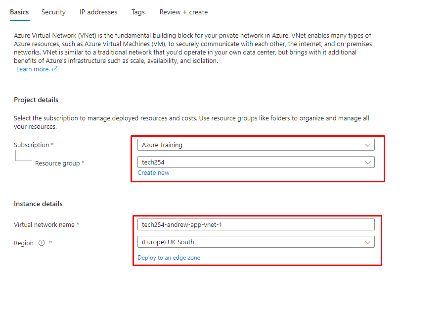
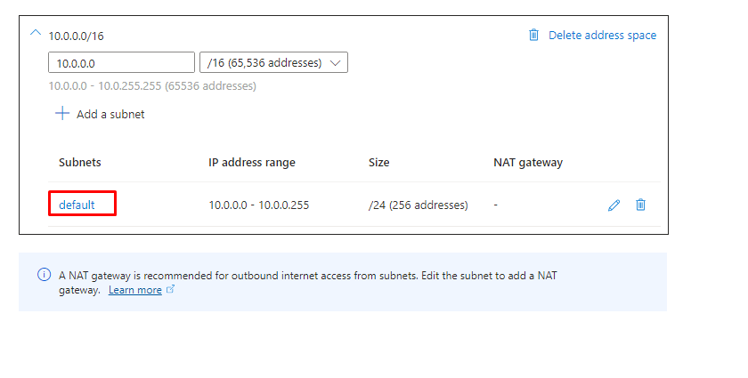
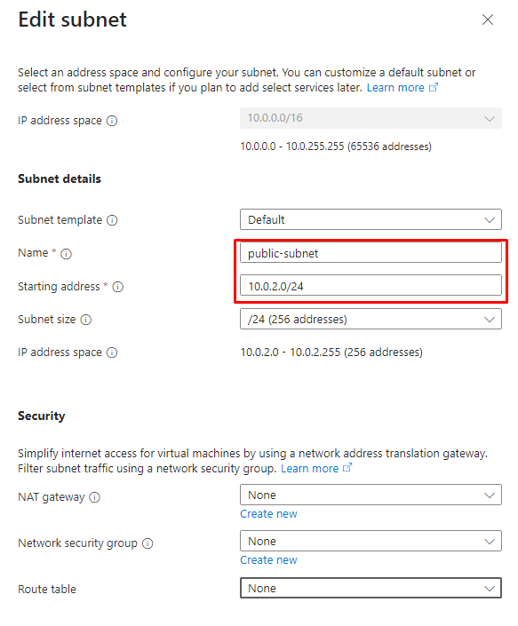
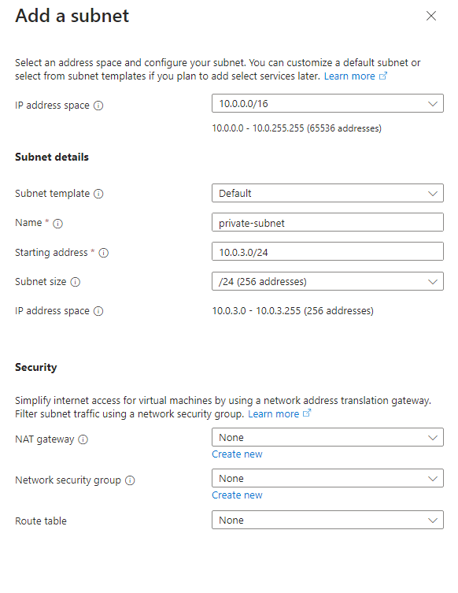
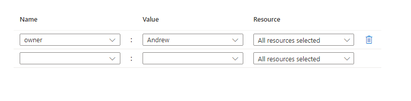

# How to set up a Virtual Network in Azure

## Basics

1. Subscription: Azure Training
2. Resource Group: tech254
3. Virtual Network Name: `tech254-andrew-<use-case>-vnet`
4. Region: (Europe) UK South

## Security

Leave blank.

## IP Addresses

1. Click on the default subnet:

2. Set the name to `public-subnet` and Starting Address `10.0.2.0/24`

3. Add in a `private-subnet`, with starting address of `10.0.3.0/24`

## Tags

## Review

If everything is correct, create.
