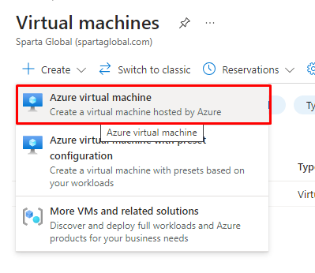
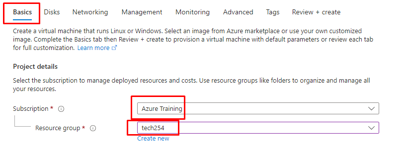
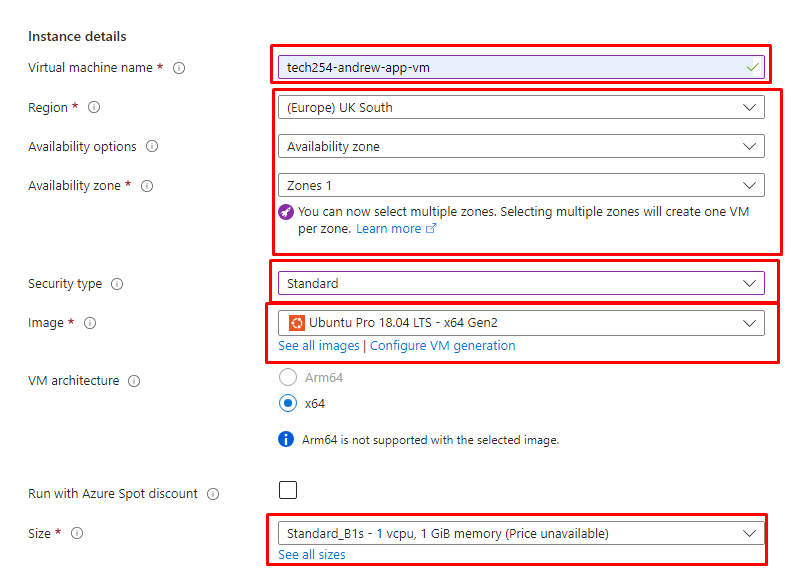
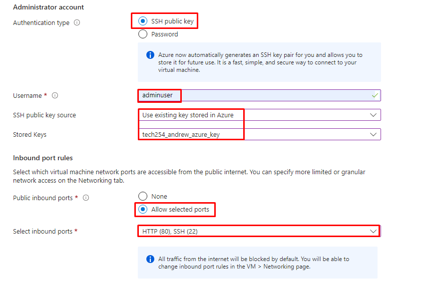
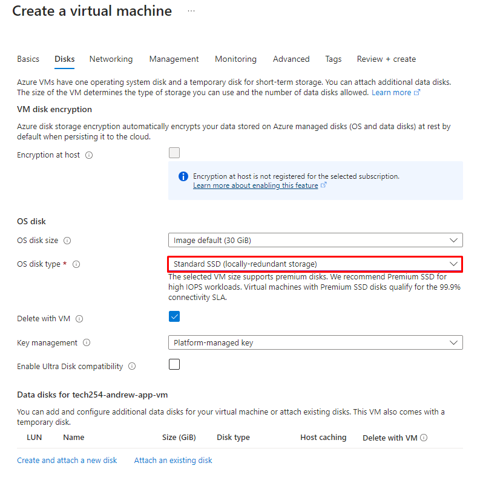
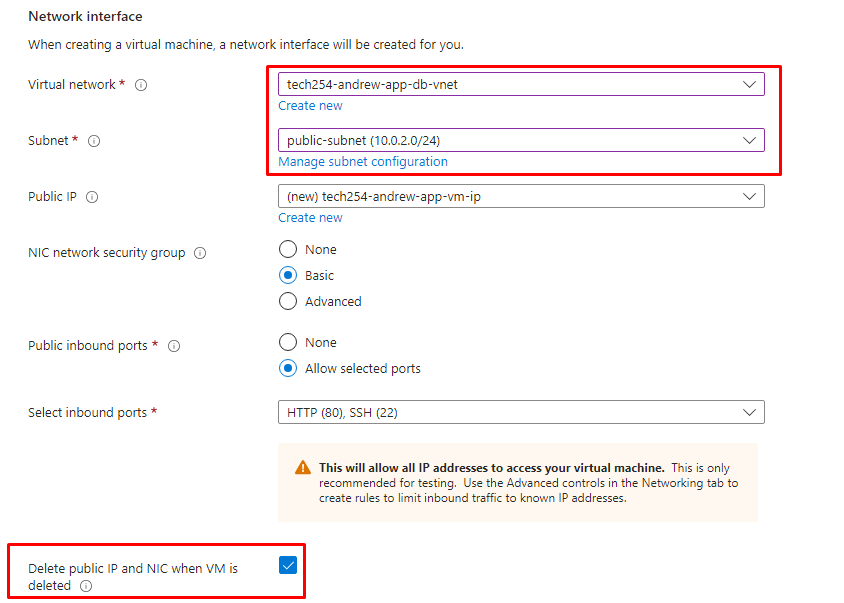

# How to set up 2-tier-architecture with Vnets and VM in Azure:

1. Create Azure Virtual Machine.



## Basics:

### Project Details:

1. Subscription: Azure Training
2. Resource Group: tech254



### Instance details:

1. Virtual Machine Name: 

```
tech254-andrew-app-vm
```

2. Region: UK South
3. Availability Options: Availability Zone
4. Availability Zone: Zones 1 ( Selecting more than this will create VM's in all selected regions)
5. Security Type: Standard
6. Image: Ubuntu Pro 18.04 LTS - x64 Gen2
7. Size: 

```
Standard_B1s - 1vcpu, 1GiB memory
```



### Administrator Accouint & Inbound Port Rules:

1. Authentification Type: SSH public key
2. Username: adminuser
3. SSH Public Key Source: Use existing key stored in Azure
4. Stored Keys: `tech254_andrew_azure_key`
5. Public inbound ports: Allow selected ports
6. Selected inbound ports: HTTP (80), SSH (22)



## Disks:

1. OS disk type: Standard SSD.



## Networking:

### For Database:

1. Virtual Network: `tech254-andrew-app-db-vnet`
2. Subnet: `private-subnet`
3. Public IP: `None`
4. Select Inbound ports: SSH (22)
5. Delte public IP and NIC when VM is deleted: Enabled.

### For App:

5. Virtual Network: `tech254-andrew-app-db-vnet`
6. Subnet: `public-subnet`
7. Select Inbound ports: HTTP (80), SSH (22)
8. Delete public IP and NIC when VM is deleted: Enabled.



## Management & Monitoring:

Nothing.

## Advanced:

Nothing before user data.

## Custom Data:

Custom Data for DB:

```
#!/bin/bash

# Sets the environment to noninteractive, meaning it won't prompt for user input
sudo DEBIAN_FRONTEND=noninteractive apt-get upgrade -y -o Dpkg::Options::="--force-confnew" -y

# update & upgrade
sudo apt update -y
sudo apt upgrade -y

# Acquire the MongoDB 3.2 key
wget -qO - https://www.mongodb.org/static/pgp/server-3.2.asc | sudo apt-key add -
echo "Acquired MongoDB 3.2 key successfully."

# Add MongoDB repository to sources.list
echo "deb http://repo.mongodb.org/apt/ubuntu xenial/mongodb-org/3.2 multiverse" | sudo tee /etc/apt/sources.list.d/mongodb-org-3.2.list

# Update packages to fetch MongoDB 3.2
sudo apt update

# Install MongoDB 3.2 packages
sudo apt-get install -y mongodb-org=3.2.20 mongodb-org-server=3.2.20 mongodb-org-shell=3.2.20 mongodb-org-mongos=3.2.20 mongodb-org-tools=3.2.20
echo "MongoDB 3.2 installed successfully."

# Modify MongoDB configuration to allow all connections
sudo sed -i 's/bindIp: 127.0.0.1/bindIp: 0.0.0.0/' /etc/mongod.conf
echo "Modified MongoDB configuration to allow all connections."

# Start MongoDB and enable auto-start
sudo systemctl start mongod
sudo systemctl enable mongod
```

Custom Data for app:

```
#!/bin/bash

# Sets the environment to noninteractive, meaning it won't prompt for user input
sudo DEBIAN_FRONTEND=noninteractive apt-get upgrade -y -o Dpkg::Options::="--force-confnew" -y

# update & upgrade
sudo apt update -y
sudo apt upgrade -y

#install, restart, enable
sudo apt install nginx -y
sudo systemctl restart nginx
sudo systemctl enable nginx

# setup nginx reverse proxy
sudo apt install sed
# $ and / characters must be escaped by putting a backslash before them
sudo sed -i "s/try_files \$uri \$uri\/ =404;/proxy_pass http:\/\/localhost:3000\/;/" /etc/nginx/sites-available/default

sudo systemctl restart nginx
sudo systemctl enable nginx

#install tree, git
sudo apt install tree -y
sudo apt install git-all -y

#install correct Nodejs version
curl -sL https://deb.nodesource.com/setup_12.x | sudo -E bash -

#install NodeJs, pm2
sudo apt install nodejs -y
sudo npm install pm2 -g

#clone from repo
git clone https://github.com/JK-A2023/Sparta_app.git

#Move into correct folder
cd Sparta_app/app

# Export the db ip for mongodb connection:
export DB_HOST=mongodb://<database_private_ip>:27017/posts 

#Install dependencies
npm install -y

#Run file
pm2 start app.js
```

## SSH'ing into VM's.

### App instance:

1. Use the Native SSH method to SSH into App Instance.

### Database instance:

1. From the App instance terminal, cd into .ssh.
2. Copy across the azure key from local machine into app instance .ssh folder:

```
cat <file_name> | clip
```

3. Create a file within the .ssh directory to hold the key:

```
sudo nano <file_name>
```

4. Paste in the copied key, and save.
5. Now, you can use the Native SSH method to SSH into the database instance through the App instance.
