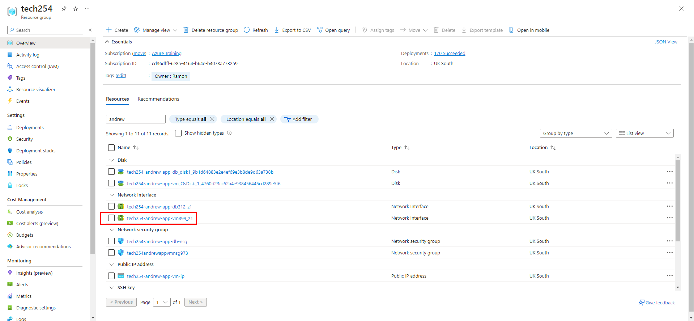
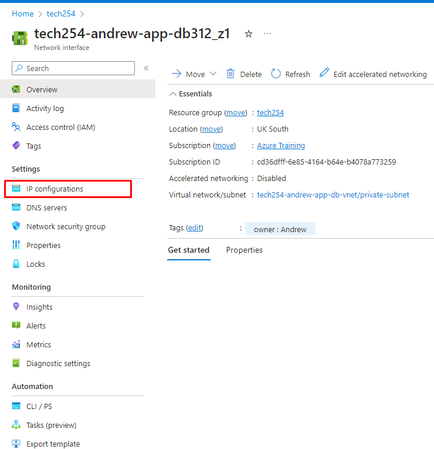
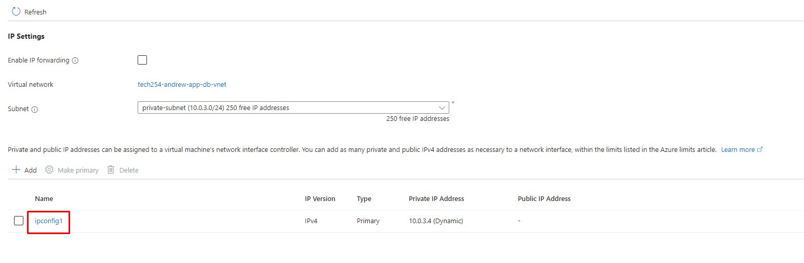
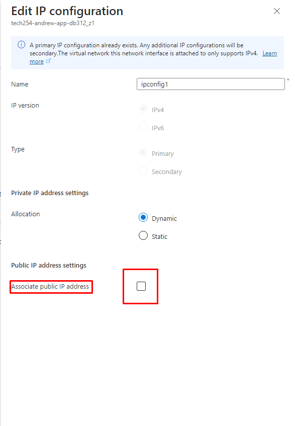
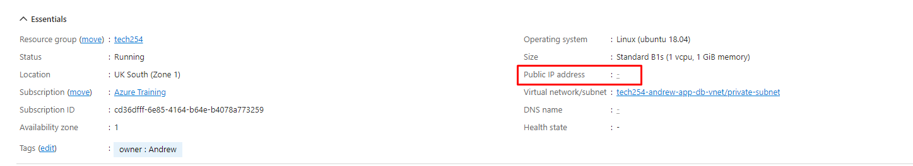

# How to unassociate an IP from a VM using NIC

1. Locate desired Network Interface associated with a virtual machine:

2. Navigate to IP configurations:

3. Select the ipconfig:

4. Unselect the "Associate public IP address" box:

5. Check your associated VM to see if it has been unlinked:

The opposite works for reconnecting an IP address to a VM.