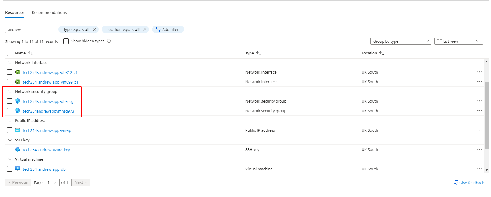
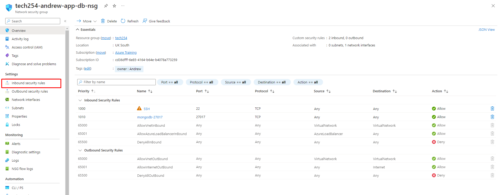
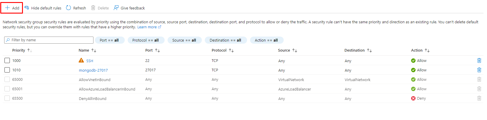
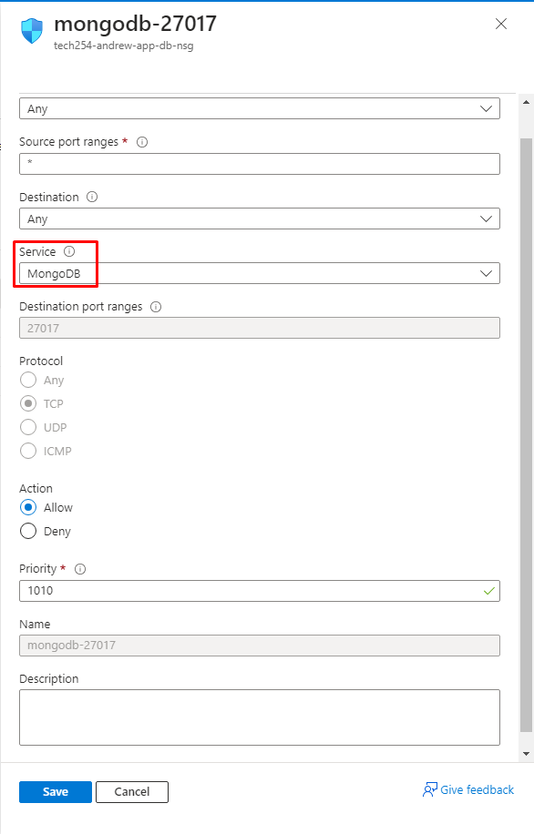
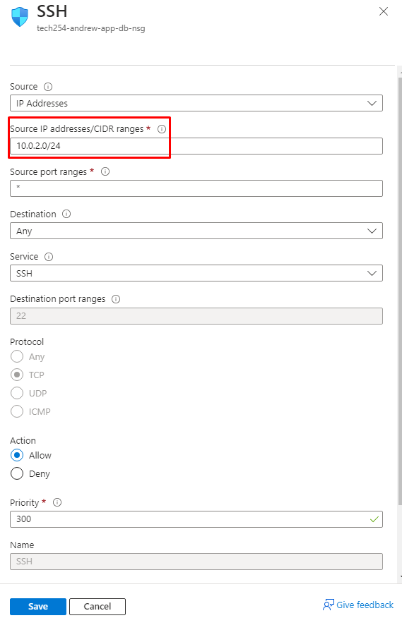
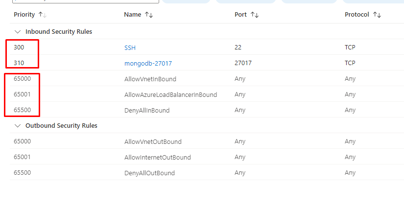

# How to configure Security Groups:

1. Search in the Overview for your resource group.
   1. I filtered by my name as it's the naming convention I used for my resources.

2. Select the desired NSG you want to congfigure.
   1. Here, I will configure the database NSG to allow MongoDB.

3. You will see the following page:
   1. To add a rule, select the highlighted Inbound Security Rules button:

4. To add a new rule, select the add button:

5. Here you can select the Source, Ranges, Destination, Service, Destination, Protocl, Action, and priority, as well as the name:
   1. For mongoDB, follow these settings:

# Tightening Security:

1. Allow only your Subnet IP address range:

2. Input range:

3. Make sure Priority of your own rules is greater (lower the number, higher the priority) than Denial rules:

