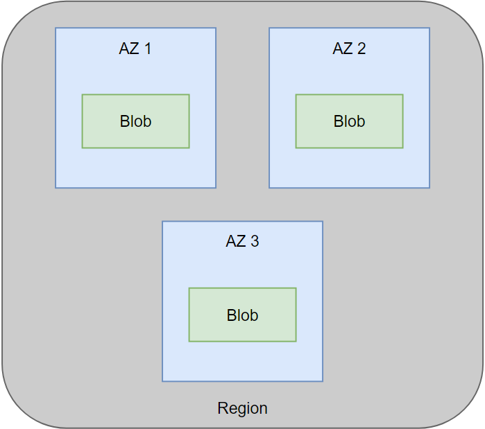

# Blob Storage:

A blob is an unstructured data storage resource, analogous to AWS's S3 bucket.

## Layers

Blobs have three layers:

1. Storage Account:
2. Container
3. Blob

## Access

Containers have frequency tiers depending on how often they're accessed. In order:

1. Hot
2. Cool
3. Archival

## Redundancy

### LRS

Local Redundancy Storage stores 3 versions of the storage account within one Availability Zone.

## ZRS

Zone Redundancy Storage stores 3 versions of the storage account across all 3 Availability Zones within a region (as Azure has a max of 3 regions at all times).

