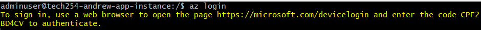
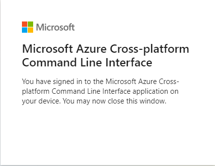

# Azure CLI

## How to install:

For Ubuntu / Debian systems using apt:

```
curl -sL https://aka.ms/InstallAzureCLIDeb | sudo bash
```

Link:

https://learn.microsoft.com/en-us/cli/azure/install-azure-cli

## How to login:

```
az login
```

You will see the following:



Follow the link, copy and paste the code, and confirm account:



