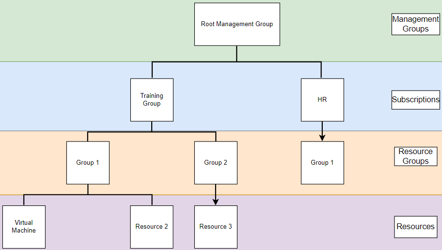
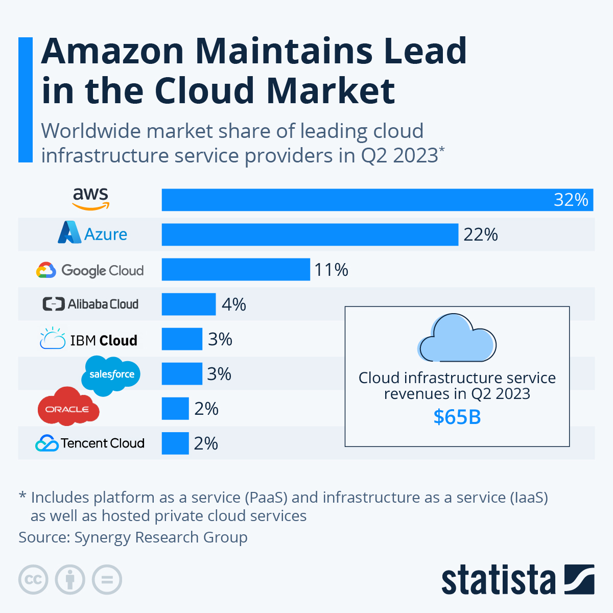

# Azure

## What is Azure:

- A cloud computing platform run by Microsoft.
- Offers Software as a Service (SaaS), Platform as a Service (PaaS), and Infrastructure as a Service (IaaS)

## Management Levels

1. Management Groups
   1. Manage access, policies, and compliance for subscriptions. Use management groups to organise subscriptions based on departments.
2. Subscriptions
   1. Each subscription has its own billing. Groups resources.
3. Resource Groups
   1. Containers in which you provision abilities to create resources.
4. Resources
   1. The resources themselves, such as VM's, virtual networks, contained within Resource Groups.

## Market Share

Azure has 22% of market share.

## Extra Advantages of using the Cloud

## How is our resources structured or organised.

