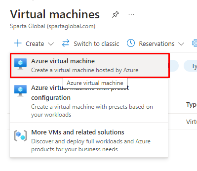
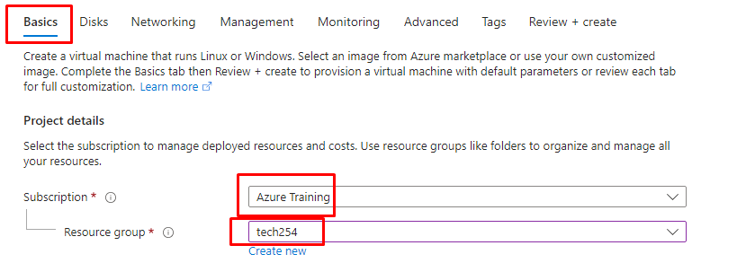
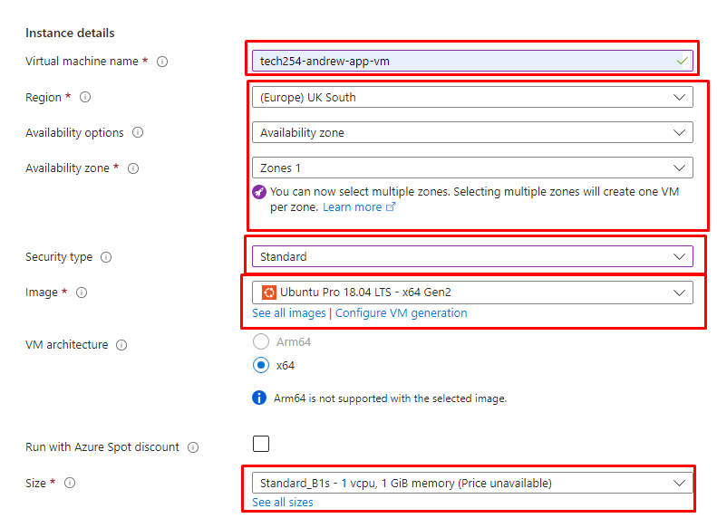
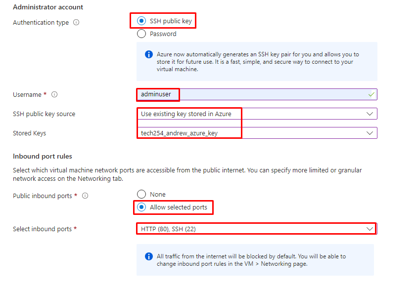
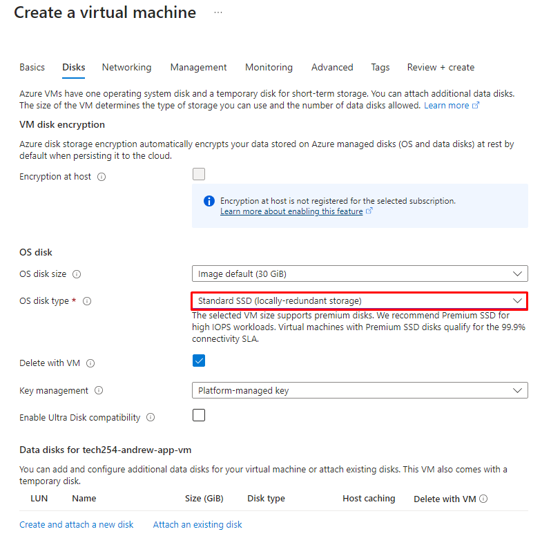

# How to set up a VM in Azure:

1. Create:



## Basics:

### Project Details:

1. Subscription: Azure Training
2. Resource Group: tech254



### Instance details:

1. Virtual Machine Name: 

```
tech254-andrew-app-vm
```

2. Region: UK South
3. Availability Options: Availability Zone
4. Availability Zone: Zones 1 ( Selecting more than this will create VM's in all selected regions)
5. Security Type: Standard
6. Image: Ubuntu Pro 18.04 LTS - x64 Gen2
7. Size: 

```
Standard_B1s - 1vcpu, 1GiB memory
```



### Administrator Accouint & Inbound Port Rules:

1. Authentification Type: SSH public key
2. Username: adminuser
3. SSH Public Key Source: Use existing key stored in Azure
4. Stored Keys: `tech254_andrew_azure_key`
5. Public inbound ports: Allow selected ports
6. Selected inbound ports: HTTP (80), SSH (22)



## Disks:

1. OS disk type: Standard SSD.



## Networking:

1. Virtual Network: `tech254-andrew-app-db-vnet`
2. Subnet: `public-subnet`
3. Select Inbound ports: HTTP (80), SSH (22)
4. Delte public IP and NIC when VM is deleted: Enabled.


## Management & Monitoring:

Nothing.

## Advanced:

Nothing before user data.

### User Data:

